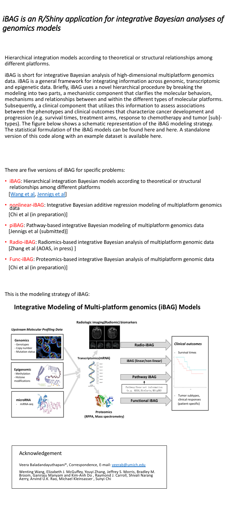

  

###  ***iBAG*** is an R/Shiny application for integrative Bayesian analyses of genomics models

##### Hierarchical integration models according to theoretical or structural relationships among
##### different platforms.
##### iBAG is short for integrative Bayesian analysis of high-dimensional multiplatform genomics data. iBAG is a general framework for integrating information across genomic, transcriptomic and epigenetic data. Briefly, iBAG uses a novel hierarchical procedure by breaking the modeling into two parts, a mechanistic component that clarifies the molecular behaviors, mechanisms and relationships between and within the different types of molecular platforms. Subsequently, a clinical component that utilizes this information to assess associations between the phenotypes and clinical outcomes that characterize cancer development and progression (e.g. survival times, treatment arms, response to chemotherapy and tumor [sub]-types). The figure below shows a schematic representation of the iBAG modeling strategy. The statistical formulation of the iBAG models can be found here and here. A standalone version of this code along with an example dataset is available here.

#### There are five versions of iBAG for specific problems:
> + [`Linear iBAG`](https://github.com/umich-biostatistics): insert description
> + [`Non-linear iBAG`](https://github.com/umich-biostatistics):  insert description
> + [`Radio iBAG`](https://github.com/umich-biostatistics):  radiographic imaging + multiplatform genomics
> + [`piBAG`](https://github.com/umich-biostatistics): iBAG + functional/pathway information
> + [`Functional iBAG`](https://github.com/umich-biostatistics): insert description

#### This is the modeling strategy of iBAG:

